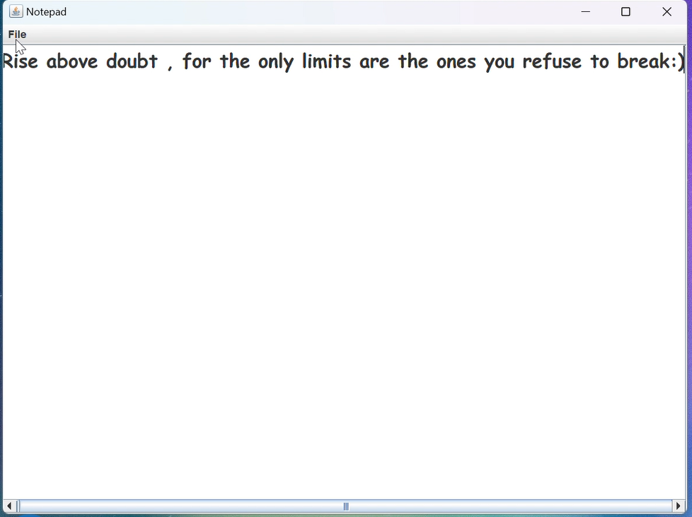

<<<<<<< HEAD
# Notepad Application 📝

This is a **native Java** implementation of a lightweight **Notepad** application. It features a simple yet functional graphical user interface (GUI) built using `Swing`, allowing users to create, edit, save, and open text files.

---

## 🖼️ Demo

### Application Screenshot:
[](capture/NoteVid.mp4)
> "Click the image above to watch the video."

---

## 🚀 How to Use

### Prerequisites
- **Positive mindset** and **willingness to embrace your full potential**.

### Clone the Repository
1. Open your terminal or command prompt and clone the repository:
```bash
   git clone https://github.com/yourusername/motivational-note.git
```
2. Navigate to the cloned repository:
```bash
cd motivational-note
```
=======

